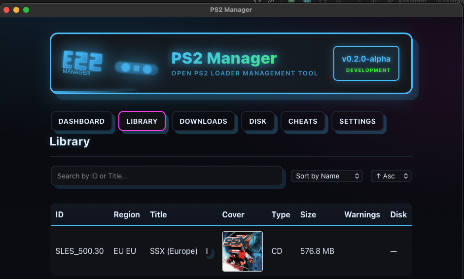
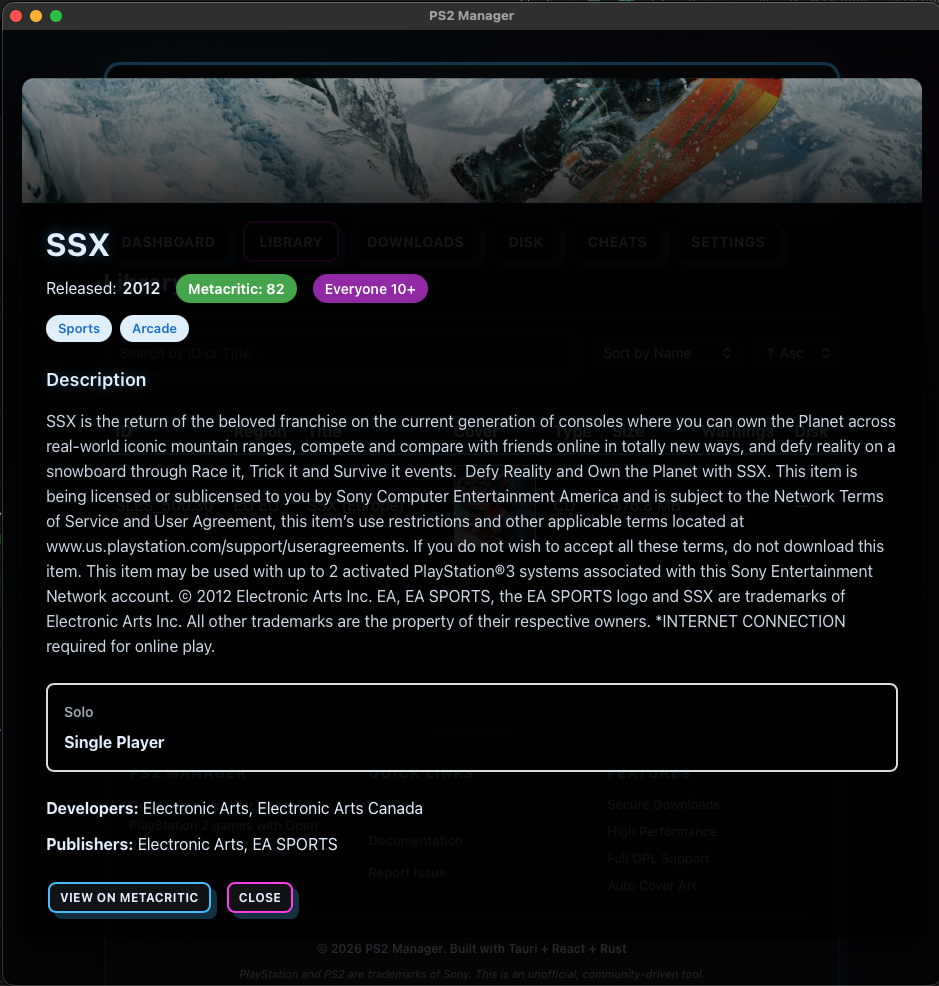
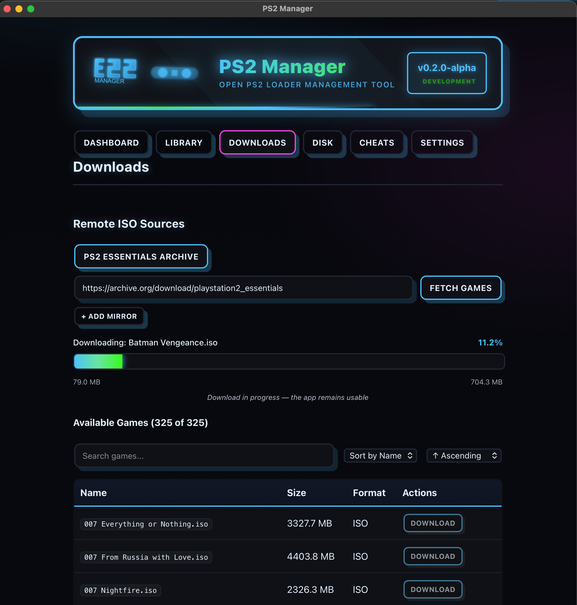

# PS2 Manager (OPL) — Tauri + React + TypeScript

Desktop app (macOS/Windows) to manage PlayStation 2 game catalogs for Open PS2 Loader (OPL): scan ISOs, fetch covers, handle cheats/VMC, and keep folders clean.

###### GAMES VIEW


###### GAME DETAILS VIEW


###### DOWNLOADS VIEW


## Key features
- **OPL integration**: Detect/validate `DVD/`, `CD/`, `ART/`, `CFG/`, `CHT/`, `VMC/` and auto-fix missing folders.
- **Catalog tools**: Scan ISOs, extract IDs, smart rename (`ID - Title.iso`, 80 chars), export JSON.
- **Covers**: Auto-fetch from GameTDB with batch mode; delete/re-fetch; PNG re-encode.
- **Cheats & VMC**: Edit/save `.CHT`, import/export VMC.
- **Remote downloads**: Archive.org browsing with progress, integrity checks, cleanup, and auto-scan.
- **Utilities**: Duplicate detector, backup/restore, search & filter, toasts, optimized rendering.

## Prerequisites
- **Node.js** 20+ and **pnpm** 9+ (corepack recommended)
- **Rust** (stable via rustup) and **Xcode CLT** on macOS
- **RAWG API Key** (optional, for game metadata) - Get free at [rawg.io/apidocs](https://rawg.io/apidocs)
- No Windows machine required for dev; Windows builds via CI later

## Quick start
```bash
pnpm install

# Optional: set RAWG API key for game metadata (free at https://rawg.io/apidocs)
export RAWG_API_KEY="your-api-key-here"

pnpm run tauri:dev
```

## How to use (overview)
- **Scan disk/library**: Detect OPL root, validate folders, list games.
- **Fix structure**: Auto-create required directories.
- **Rename safely**: Preview and apply `ID - Title.iso` with 80-char cap.
- **Fetch covers**: Batch or per-game.
- **Manage cheats/VMC**: Open/save `.CHT`, import/export VMC files.
- **Download ISOs**: Browse Archive.org, validated downloads with cleanup.
- **Back up**: Export/import catalog and settings.

## OPL folder structure
At the OPL root (or in `OpenPS2Loader/`):
- `DVD/`, `CD/`
- `ART/`, `CFG/`, `CHT/`, `VMC/`

This app validates/creates these folders. Place PS2 ISOs into `DVD/` or `CD/` (size is a good hint: CDs < 750 MB, DVDs 1–4.7 GB).

## Naming rules
- Default: `ID - Title.iso`
- Enforced limit: `<= 80` characters including the extension
- Safe characters only; consecutive spaces collapsed

## Scripts
- `pnpm run tauri:dev` — Dev server (Vite + Tauri)
- `pnpm run tauri:build` — Build/bundle app
- `pnpm run dev` / `pnpm run build` — Frontend only

## Architecture

### Backend (Rust)
```
src-tauri/src/
├── opl.rs         # Root detection, validation, structure fixing
├── scanner.rs     # ISO scanning, ID/title extraction
├── naming.rs      # File renaming with 80-char limit
├── covers.rs      # Cover management (save/delete)
├── metadata.rs    # Auto-fetch covers from GameTDB
├── remote.rs      # Archive.org integration, ISO downloads
├── cheats.rs      # CHT file management
├── vmc.rs         # VMC import/export/delete
├── organizer.rs   # CD/DVD organization logic
├── exporter.rs    # Catalog JSON export
└── lib.rs         # Tauri builder, command registration
```

### Frontend (React + TypeScript)
```
src/
├── components/    # UI components (functional, pure)
│   ├── RemoteSourcesPanel.tsx  # Remote downloads UI
│   ├── CoverTools.tsx          # Cover management
│   ├── GamesTable.tsx          # Game list display
│   └── ...
├── pages/         # Main views (Dashboard, Library, Disk, etc.)
├── hooks/         # Custom React hooks (functional paradigm)
├── contexts/      # React contexts (NavContext, SourceContext)
├── actions/       # Tauri command wrappers
├── utils/         # Pure utility functions
│   ├── array.ts      # countBy, groupBy, uniqueBy
│   ├── format.ts     # formatFileSize, formatPercent
│   ├── statistics.ts # calculateDashboardStats
│   ├── storage.ts    # Persistent storage helpers
│   ├── theme.ts      # Theme management
│   └── validation.ts # Folder validation
├── types/         # TypeScript type definitions
└── ui/            # Shared UI components (Button, Input, etc.)
```

## Contributing

Contributions welcome! Please follow:
- **Functional paradigm**: Pure functions, immutable state
- **TypeScript**: Types over interfaces
- **Testing**: Add tests for new features
- **Documentation**: Update README and guides

## License

See LICENSE file.

---

## Platform support
- **macOS**: Tested
- **Windows**: Planned (CI builds later)
- **Linux**: Should work but untested

## Security highlights
- HTTPS-only remote downloads with domain whitelist and path validation.
- Size limits and integrity checks for downloads.
- Auto-cleanup of failed downloads; sanitized errors.

## Roadmap / TODO
- See [TODO.md](./TODO.md) for the current priorities and backlog.
